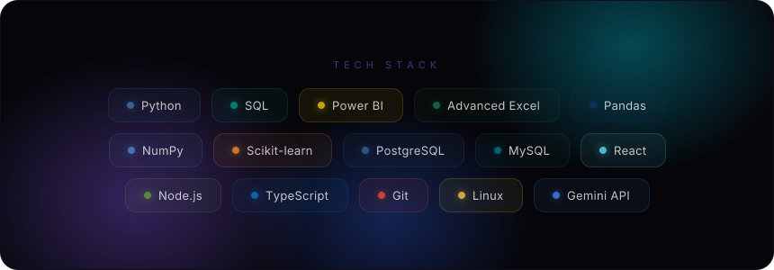
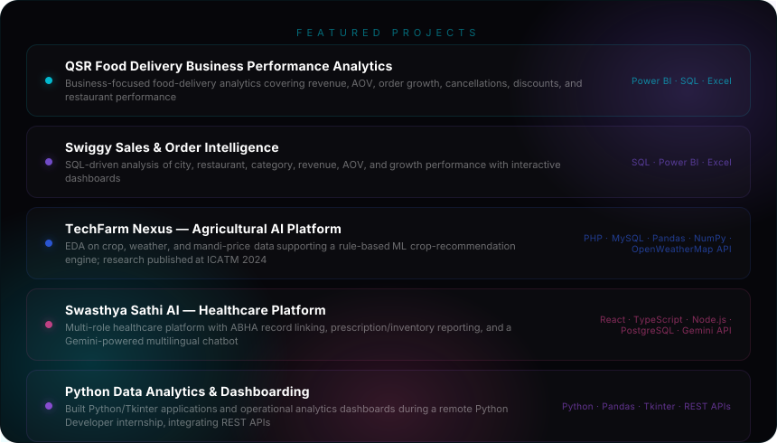
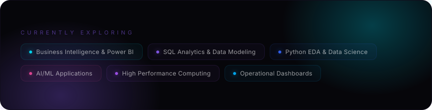

  

  

  

  

  
  

  

## Currently Exploring

`Business Intelligence` · `Power BI` · `SQL Analytics` · `Python EDA` · `Applied AI/ML` · `HPC & Parallel Programming` · `Data Visualization` · `Operational Dashboards`

## Experience, Education & Achievements

**C-DAC Mumbai (Juhu) — HPC ACC Course with Work-Based Learning** 
*Jul 2026 – Present*

- Advanced Computing Career programme with four core modules: Linux & Operating Systems, Computer Networks & Interconnects, Python & C++ Programming, and C & Data Structures.
- Building applied knowledge of Python-based statistical data handling and analysis.
- Completing a work-based learning component with a live project phase plus aptitude and communication-skills sessions.

**Pythonic Labs — Python Developer Intern** 
*Mar 2025 – Apr 2025 · Remote*

- Built 3–5 Python/Tkinter GUI desktop applications, reducing manual data-entry effort by **40%** through automation and modular architecture.
- Cleaned and analyzed operational datasets with Pandas, tracked KPIs, and built **5 interactive dashboards** integrating **4 third-party REST APIs**, cutting reporting turnaround by **60%**.

**B.E. Artificial Intelligence & Data Science** 
University of Mumbai, Kharghar · **7.75 / 10 CGPA** 
*Nov 2022 – May 2026*

### Achievements & Publications

* **Lead Organizer — HackUp 2026 (Hack The Core):** led Navi Mumbai's student hackathon with 200+ participants, multiple tracks, judges, and mentors.
* **Runner-Up — Innovathon 2025, Data Science Track:** led the team through problem scoping, task delegation, and final pitch.
* **First Author — ICATM 2024:** research based on TechFarm Nexus agricultural EDA.
* **Co-Author — PaperNova Journal:** AI in Healthcare.
* **Aavishkar Semi-Finalist ×2.**

### Certifications

* Python Full Stack + DSA
* Cursa AI Masterclass — ML & Deep Learning
* Neo4j Certified Professional
* Certified Ethical Hacker (CEH) + PRO

<!-- ═══════════════════════════════════════════════════════════════ -->

<!-- SOCIAL LINKS — Custom SocialMediaButton components             -->

<!-- ═══════════════════════════════════════════════════════════════ -->

  
  
  
  

  <strong>Kalyan, Maharashtra</strong> · <a href="tel:+918928575445">+91-8928575445</a>

<!-- ═══════════════════════════════════════════════════════════════════ -->

  

