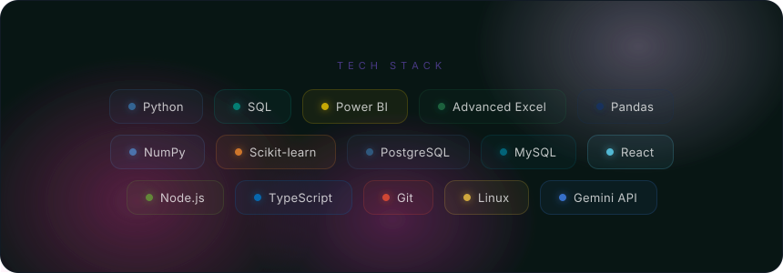
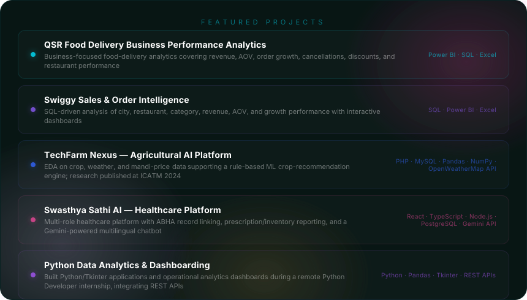
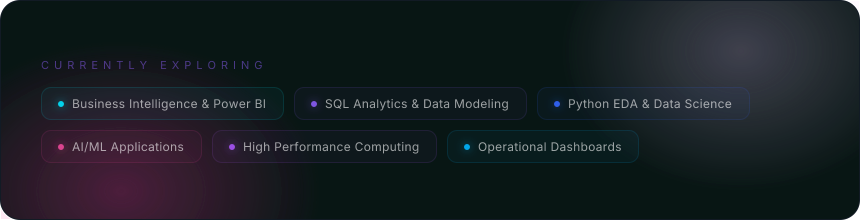

  

  

  

  

## Professional Summary

Final-year B.E. Artificial Intelligence & Data Science graduate with 2 peer-reviewed publications and hands-on experience in SQL, Python, Pandas, NumPy, Scikit-learn, and exploratory data analysis. Proficient in Python, JavaScript, TypeScript, React, Node.js, PostgreSQL, and AI/ML integration with Gemini API and GPT-4.

Built 5 live platforms serving 300+ users, with practical exposure to Linux, networking, cloud deployment, and HPC through C-DAC's Advanced Computing Career programme. Seeking Full-Stack, AI Engineering, and Data Analytics roles.

  
  

  

## Work Experience

### C-DAC Mumbai (Juhu) - HPC ACC Course with Work-Based Learning
**Jul 2026 - Present**

- Enrolled in C-DAC's HPC Advanced Computing Career programme across Linux & Operating Systems, Computer Networks & Interconnects, Python & C++ Programming, and C & Data Structures.
- Building applied knowledge of HPC architecture, parallel programming, cloud deployment, statistical data handling, ML, Deep Learning, and OpenVINO.
- Completing a work-based learning component with a live project phase and structured aptitude and communication-skills sessions.

### Pythonic Labs - Python Developer Intern
**Mar 2025 - Apr 2025 - Remote**

- Engineered 3-5 Python and Tkinter GUI applications, reducing manual data-entry effort by **40%** through automation and modular architecture.
- Cleaned and analyzed operational datasets with Pandas and built **5 interactive Matplotlib dashboards** by integrating **4 REST APIs**, cutting reporting turnaround by **60%**.

## Projects

### Swasthya Sathi AI - Healthcare Platform
**React - TypeScript - Node.js - PostgreSQL - Gemini API - JWT**

Designed data architecture for a multi-role patient, doctor, and pharmacy platform with ABHA record linking, real-time prescription and inventory reporting, a multilingual Gemini health analytics chatbot, and GPS-based emergency location. Published in PaperNova International Journal.

### TechFarm Nexus - Agricultural AI Platform
**PHP - MySQL - JavaScript - Pandas - NumPy - OpenWeatherMap API**

Performed EDA on crop, weather, and mandi-price datasets to design a rule-based ML crop-recommendation engine across a 10-module platform. Findings were published in a first-author paper at ICATM 2024.

### RHYTHMS 2026 - Annual Cultural Fest Platform
**React 18 - TypeScript - Tailwind CSS - Express.js - PostgreSQL - Vite**

Shipped a full-stack event-management platform handling 20+ events and 100+ student registrations, with PRN and DOB authentication plus QR-based digital tickets and zero post-launch downtime.

### VECTORS 2026 & INSIGNIA 2025 - Event Websites
**HTML - CSS - JavaScript - PHP - MySQL - Apache - cPanel**

Delivered VECTORS 2026 with 150+ registrations and orders using SQL-injection-safe workflows, and INSIGNIA 2025 with 35+ startup registrations and streamlined sponsor onboarding.

## Technical Skills

| Area | Technologies |
| --- | --- |
| Languages | Python, JavaScript, TypeScript, Java, SQL, PHP, C, C++ |
| Systems & Cloud | Linux Administration, Networking, HPC Architecture, Parallel Programming, Cloud Deployment |
| Frontend | React, Tailwind CSS, Bootstrap, HTML, CSS |
| Backend | Node.js, Express.js, REST APIs, JWT Authentication |
| AI/ML & Data | Gemini API, GPT-4, Scikit-learn, Pandas, NumPy, EDA |
| Databases | PostgreSQL, MySQL |
| Tools & Analytics | Git, Power BI, Matplotlib, Apache, cPanel |

## Education

**B.E. Artificial Intelligence & Data Science** 
University of Mumbai, Kharghar 
**Nov 2022 - May 2026 | Aggregate CGPA: 7.75 / 10**

## Achievements & Publications

- **Lead Organizer - HackUp 2026 (Hack The Core):** spearheaded Navi Mumbai's largest student hackathon with 200+ participants, multiple tracks, judges, and mentors.
- **Runner-Up - Innovathon 2025, Data Science Track:** led the team through problem scoping, task delegation, and the final pitch.
- **First Author - ICATM 2024:** agricultural EDA research based on TechFarm Nexus.
- **Co-Author - PaperNova International Journal:** AI in Healthcare.
- **Aavishkar Semi-Finalist x2.**

## Certifications

Python Full Stack + DSA · Cursa AI Masterclass (ML & Deep Learning) · Neo4j Certified Professional · Certified Ethical Hacker (CEH) + PRO

## Currently Exploring

`Business Intelligence` · `Power BI` · `SQL Analytics` · `Python EDA` · `Applied AI/ML` · `HPC & Parallel Programming` · `Data Visualization` · `Operational Dashboards`

## Connect

  
  
  
  

  <strong>Kalyan, Maharashtra</strong> · <a href="tel:+918928575445">+91-8928575445</a>

  

